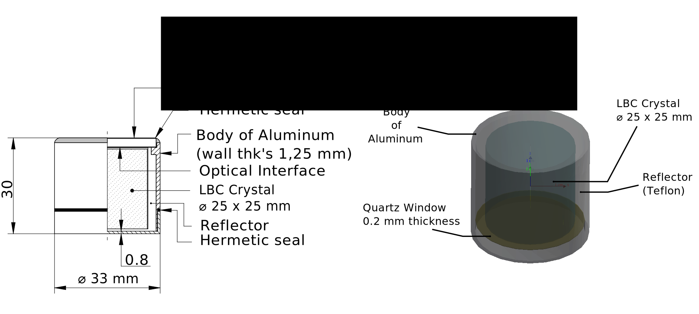
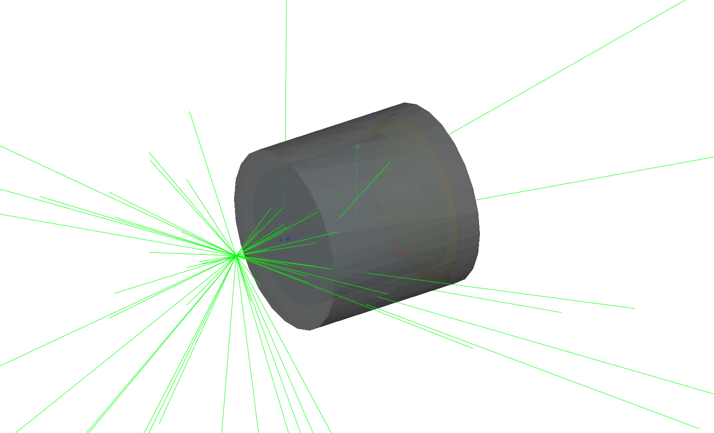

# Lanthanium Bromo-Chloride Scintillator - Geant4 Application

A Geant4 implementation of a 1"x1" cylindrical LBC scintillator.


<em>Geometry of the LBC detector.</em>


<em>Example of 50 events from a 511 keV source placed 1cm from the front of the detector.</em>

## Usage

Inside the ```macro/examples``` directory there are some examples based on GeneralParticleSource (GPS) class in order to provide flexibility to the user in defining complex sources.

The simulation scores the deposited energy on an event-by-event basis by 
adding togherer the deposited energy in each interaction which takes place inside the LBC crystal volume and save it in a ```ROOT```  tree named ```lbc_tree```.

Inside the ```macro/analysis``` folder there is a simple ROOT macro for reading the simulation output.

